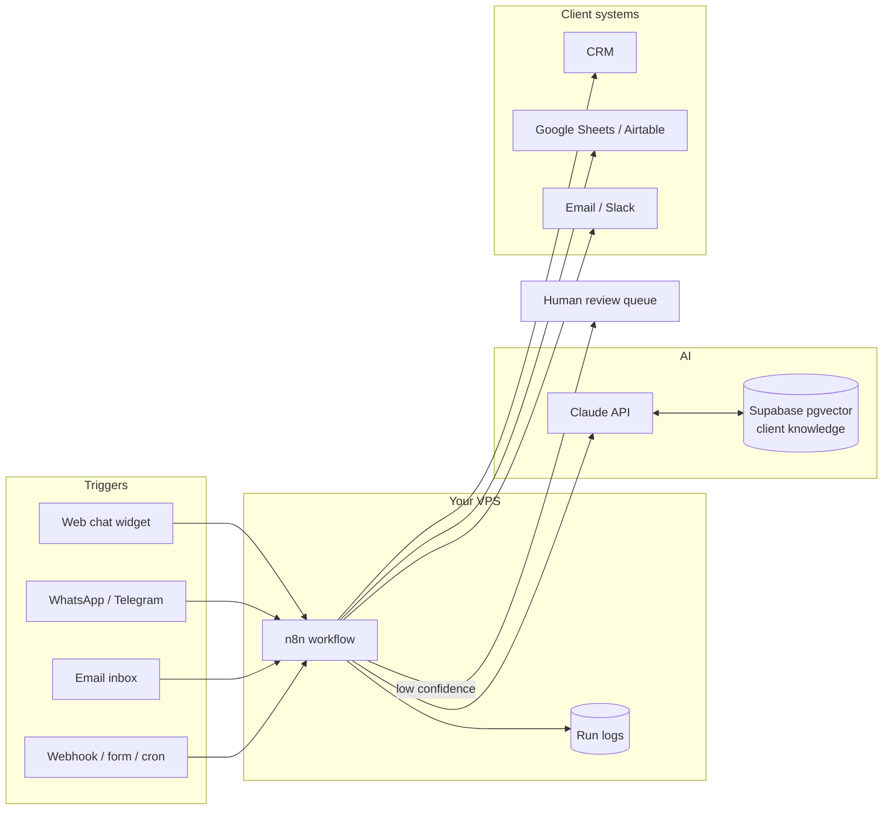

# Technical Stack & Delivery Architecture

Rule number one: **boring, cheap, reusable**. Every tool below is chosen so one person can run many clients without drowning in ops work.

## Core stack

| Layer | Choice | Why | Rough monthly cost |
|---|---|---|---|
| LLM API | **Claude API (primary)** | Strong reasoning + tool use + vision; reliable structured output for extraction tasks | Usage-based (see cost math below) |
| LLM API (secondary) | OpenAI API | Some clients ask for it by name; fallback provider | Usage-based |
| Orchestration | **n8n, self-hosted** | One-time learning, no per-task fees, hundreds of connectors, workflows export as JSON (your template library) | $0 (runs on your VPS) |
| Orchestration (alt) | Make / Zapier | Only when the client already lives there and pays for it | Client pays |
| Custom code | TypeScript or Python services | When a workflow outgrows n8n (heavy logic, custom UI) | $0–5 |
| Database / Auth / RAG | **Supabase** (Postgres + pgvector + auth) | One tool covers structured data, vector search, and login for client-facing UIs | Free tier → $25/mo |
| Hosting | VPS (Hetzner/DigitalOcean-class) with Docker | Runs n8n + small services; predictable flat cost | $10–30/mo |
| Lightweight endpoints | Cloudflare Workers | Webhook receivers, chat widget backends, glue APIs | Free tier → $5/mo |
| Channels | WhatsApp Business API, Telegram Bot API, web chat widget | Where the clients' customers actually are | ~$0 + WhatsApp conversation fees (client pays) |
| Payments | Stripe (+ Wise/Payoneer) | Retainer subscriptions, invoices | % of revenue |
| Monitoring | n8n error workflows → Telegram/Slack alerts + run logs | You must know an automation broke before the client does | $0 |

### Stack extensions for the full catalog

Added as the service menu grows through Phase 2–3 ([rollout order](02-services-catalog.md), [scaling roadmap](07-scaling-roadmap.md)) — not on day one:

| For services | Addition | Notes |
|---|---|---|
| Voice (A2, A3, A5) | Voice-agent platform (Vapi/Retell-class) + telephony (Twilio-class number) | All-in cost ≈ $0.06–0.15/min (STT + LLM + TTS + telephony); bill minutes at cost +30–50%. Always AI disclosure + instant human-transfer path |
| Content & SEO (B4–B8) | CMS/scheduler APIs, image generation API for creatives, transcript APIs for video repurposing | Human approval queue before anything publishes — no exceptions |
| Reviews (A7) | Google Business Profile / review-platform APIs | Angry reviews always route to a human first |
| Data analysis (D5) | Read-only DB access + chart rendering; Claude for SQL-from-questions | Read-only credentials are a hard rule |
| Reporting (C7) | Scheduled n8n flows + HTML-to-PDF rendering | Branded template per client, reused everywhere |
| Recruitment (C3) | ATS APIs / job-board parsing | Score with written reasoning; human makes every reject/advance decision |

**Model tiers — use the cheapest model that passes your test cases.** High-volume, simple steps (classify an email, extract a field, route a ticket) → small/fast tier (Haiku-class). Standard drafting, summarizing, RAG answers → mid tier (Sonnet-class). Complex multi-step agent reasoning → top tier, sparingly. This single habit is the difference between 80% and 30% margin on retainers.

## Reference architecture

Most client automations are the same shape:

Key pattern: **every AI step has a confidence gate.** If extraction confidence is low or the chatbot doesn't know, the item goes to a human review queue (a Slack message, an Airtable view) instead of guessing. This is what makes clients trust the system — and what keeps you out of trouble.

## Multi-client isolation

- **Start:** one VPS, one n8n instance, strict separation by n8n projects/folders + **separate credentials per client** stored only in n8n's credential vault. Never reuse an API key across clients.
- **From ~5 retainer clients:** one n8n container per client (Docker makes this trivial) on the same VPS. Cleaner offboarding — hand over their container and walk away — and one client's runaway workflow can't slow the others.
- **LLM keys:** for larger clients, use *their* Anthropic/OpenAI account key so usage bills them directly. For small clients, use your key with per-client usage tracking and an allowance in the retainer.
- **Data:** client documents live in that client's Supabase project or schema. Delete on offboarding (contract says so — see [Operations & Legal](05-operations-legal.md)).

## Cost of goods per client (example math)

Support chatbot, **2,000 conversations/month**, average 6 messages each, RAG context ~3k tokens per reply, mid-tier model for answers + small model for routing:

- ~2,000 × 4k input tokens + 2,000 × 300 output tokens ≈ 8M input + 0.6M output tokens/month
- At mid-tier API rates that is roughly **$25–40/month** in tokens
- VPS share ≈ $5, Supabase share ≈ $5 → **total COGS ≈ $35–50/month**

Against a $150–350/month retainer, margin is healthy — *if* you use tiered models and cache the knowledge base properly (prompt caching cuts repeated-context cost a lot). Re-run this math per client at their real volume before quoting the retainer allowance.

## Reliability & safety practices

- **Retries with backoff** on every external call; idempotency keys on actions that must not double-fire (emails, CRM writes, anything money-adjacent).
- **Prompt versioning:** prompts live in git (this repo's private sibling), not only inside n8n nodes. Every client change is a commit.
- **Test cases per automation:** 10–20 real examples with expected outputs, run before every prompt or model change. This is your regression suite and your delivery acceptance test.
- **Human-in-the-loop by default** for anything customer-visible or irreversible, until weeks of clean logs justify loosening it.
- **PII basics:** collect only what the automation needs, mask what you can in logs, know which country's data you hold.

## Build vs buy

- **Buy/assemble** when an off-the-shelf tool does 90% of the job (e.g. an existing chat-widget platform the client already pays for) — wire it up, charge for the integration and the brain, not the wheel.
- **Build** (n8n + Claude) when the value is in custom logic across the client's systems — that's your moat and your retainer.
- **The real asset is the template library.** Every delivered project becomes an exported n8n workflow JSON + prompt set + test cases in your private repo. Project #10 in a niche should take 30% of the time of project #1 at a higher price.
